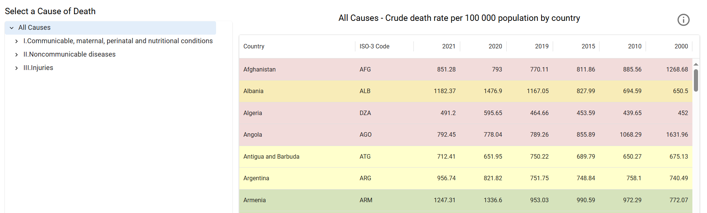

# WHO Cause of Death Data Explorer


*(Optional: Replace placeholder.png with an actual screenshot of your application)*

This is a web application built with React, TypeScript, and Material UI to explore crude death rate data by cause of death across different countries and years, based on data primarily sourced from the World Health Organization (WHO).

## Features

*   **Hierarchical Cause Selection:** Browse and select specific causes of death using an interactive tree view.
*   **Data Table Display:** View crude death rates per 100,000 population for selected causes, broken down by country. Data includes years: 2021, 2020, 2019, 2015, 2010, 2000.
*   **Data Quality Indicators:** Table rows are color-coded to represent the estimated quality and completeness of the underlying death registration data for each country (see Data Source section below).
*   **Informative Dialog:** An information dialog provides details about the data source, the metric used (crude death rate), and explains the meaning of the data quality color codes.
*   **Responsive Design:** Built with Material UI's grid system for usability on different screen sizes.
*   **Loading & Error States:** Provides visual feedback while data is being fetched or if an error occurs.

## Tech Stack

*   **React:** JavaScript library for building user interfaces.
*   **TypeScript:** Superset of JavaScript adding static typing.
*   **Material UI (MUI):** React component library implementing Google's Material Design.
*   **Fetch API:** Used for retrieving data from local JSON files.

## Getting Started

These instructions will get you a copy of the project up and running on your local machine for development and testing purposes.

### Prerequisites

*   Node.js (LTS version recommended)
*   npm (usually comes with Node.js) or yarn

### Installation

1.  **Clone the repository:**
    ```bash
    git clone [Your Repository HTTPS or SSH Link Here]
    cd [your-repository-folder-name]
    ```

2.  **Install dependencies:**
    ```bash
    npm install
    # or
    yarn install
    ```

### Running the Application

To start the development server:

```bash
npm start
# or
yarn start